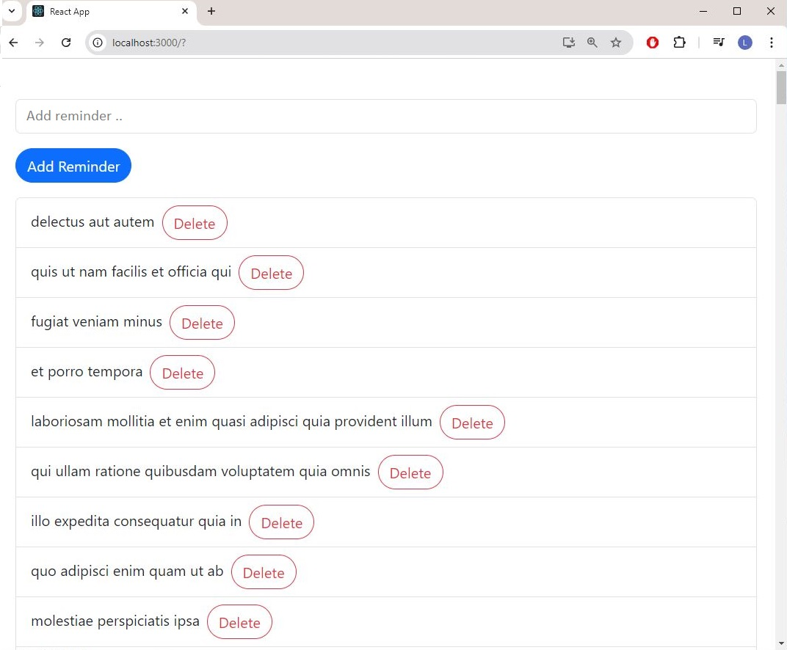
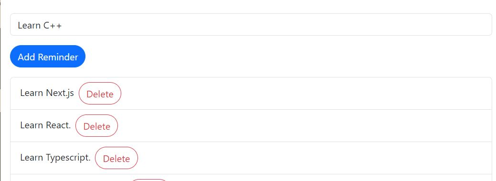

 
# Todo - Reminder App (Project 2 - Basic React + Typescript)

# 

# Todo - Reminder App

<table>
<tr>
<td>
  - This app is a basic Todo - Reminder app.
 </td>
</tr>
<tr>
<td>
  - Technologies: Typescript, React, Bootstrap, JSONplaceholder
 </td>
</tr>
</table>
## Demo: https://xxxxxxxxxx
## Built with

Typescript, React, Bootstrap, JSONplaceholder

## How to build:
  - npx create-react-app reminders-app --template typescript
  - gh auth login
  - gh repo create `<`repo-name`>` --public
  - git remote add origin https://github.com/luongkhdang/Project2-Todo-Typescript-React.git
  - git push -u origin master
  - npm i boostrap
  - install extension "Reactjs code snippets"
    
### Landing Page

>> 

### Query Filled Form

>> 

## Mobile support

### Development

Want to contribute? Great!

To fix a bug or enhance an existing module, follow these steps:

### Bug / Feature Request

## To-do

## Team

[Luong Dang](https://github.com/luongkhdang)

## [License](https://github.com/luongkhdang/xxxxx/LICENSE.md)

MIT © [Luong Dang ](https://github.com/luongkhdang)
